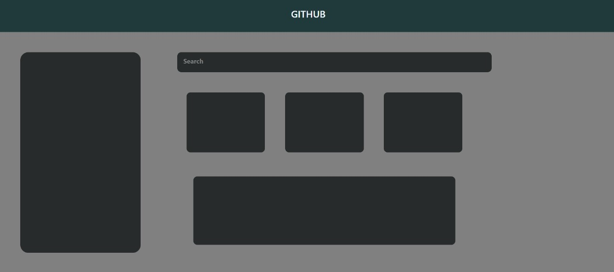

<h1>Github Profile</h1>

To achieve the github profile layout. I used bootstrap rows&cols to create new row and used cols to split the columns. no of divs with style properties heigth, width, border-radius..etc

<h3>Learned</h3>
<ul>
  <li>border-radius</li>
   <li>margining between two container</li>
   <li>icons</li>
</ul>
<h2>And my output will be</h2>

